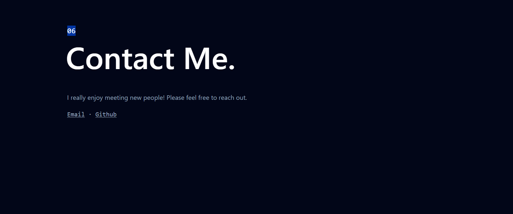

# Personal Website

A modern, responsive personal website showcasing my portfolio, projects, and interests. Designed for performance, accessibility, and simplicity.



---

### 🧰 Tech Stack

Built with:

- **Next.js** – React framework for fast, SEO-friendly web apps
- **Tailwind CSS** – Utility-first CSS framework for rapid UI development
- **Vercel** – Deployment and hosting platform

---

### 🚀 Features

- Responsive layout for all devices
- Optimized performance and SEO
- Clean, minimal design
- Easy to customize and extend

---

### 🧩 Local Development

To run the project locally:

```bash
# 1. Clone the repository
git clone https://github.com/your-username/personal-website.git

# 2. Navigate to the project directory
cd personal-website

# 3. Install dependencies
npm install

# 4. Start the development server
npm run dev

# 5. Then open your browser and go to:
👉 http://localhost:3000
```

### 🔗 Deployment

The site is deployed with Vercel, offering seamless integration with GitHub and automatic deployments on push.
